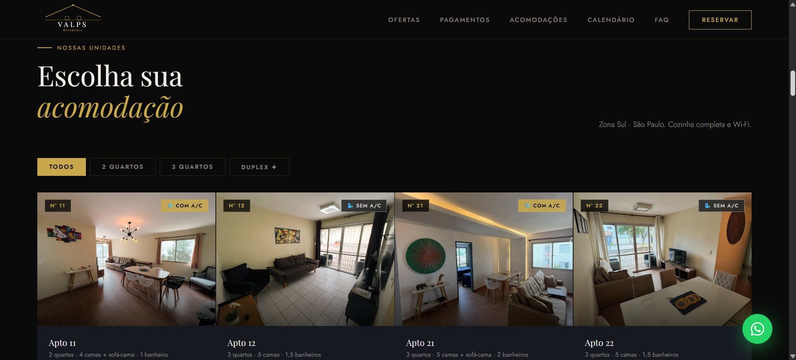
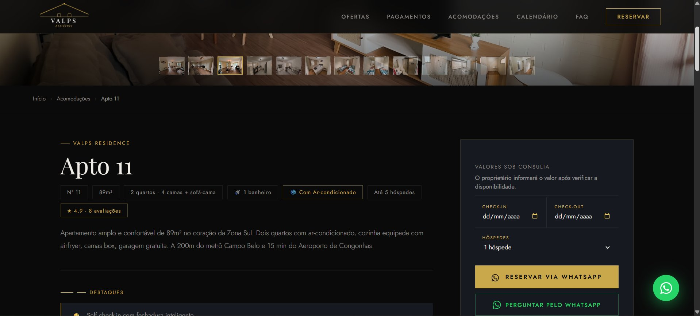
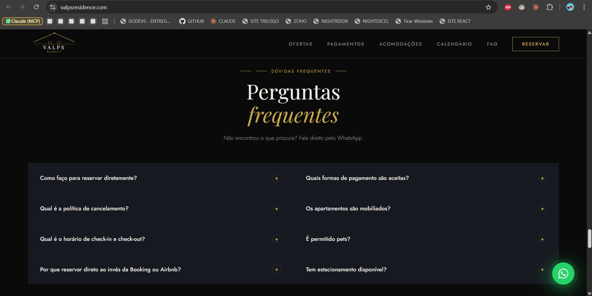

# 🏨 Valps Residence

Site oficial de hospedagem do Valps Residence — 13 apartamentos modernos com reserva direta, sem taxas de intermediários.

🔗 **[Ver site ao vivo](https://valpsresidence.com)**

---

## 📸 Screenshots

### Hero — Tela Inicial


### Acomodações


### Página do Apartamento


### Formas de Pagamento


### Criptomoedas


### Formulário de Reserva


### FAQ


---

## 📖 Sobre o Projeto

Landing page completa para o Valps Residence, com sistema de reservas integrado ao WhatsApp e Firebase. O site apresenta os apartamentos disponíveis, calendário de disponibilidade, promoções e formulário de reserva — tudo com foco em conversão direta sem intermediários como Airbnb.

---

## ✨ Funcionalidades

- Galeria de apartamentos com carrossel de fotos e detalhes individuais
- Sistema de busca com filtro por data de check-in, check-out e número de hóspedes
- Formulário de reserva com envio automático via WhatsApp
- Integração com Firebase Firestore para salvar reservas em tempo real
- Calendário de disponibilidade interativo
- Seção de promoções e ofertas especiais
- Seção de localização com mapa integrado
- Formas de pagamento: PIX, Transferência, Link de Pagamento e Criptomoedas (BTC, ETH, SOL)
- FAQ com perguntas frequentes
- Design responsivo para mobile e desktop
- Botão flutuante do WhatsApp em todas as páginas

---

## 🛠️ Tecnologias

- HTML5
- CSS3
- JavaScript (Vanilla)
- Firebase Firestore (banco de dados em tempo real)
- Google Apps Script (sincronização automática com Google Sheets)
- Netlify / GitHub Pages (hospedagem)

---

## 🔗 Integrações

### Firebase + Google Sheets
As reservas feitas pelo site são salvas automaticamente no Firebase Firestore e sincronizadas a cada hora com uma planilha Google Sheets via Google Apps Script. A planilha conta com:

- Aba **Reservas Firebase** com todas as reservas do site
- Aba **Dashboard** com gráficos e KPIs: total de reservas, receita, ticket médio, ranking de apartamentos e faturamento por mês

### WhatsApp
Ao preencher o formulário de reserva, o sistema monta automaticamente uma mensagem com os dados do hóspede e redireciona para o WhatsApp do Valps Residence.

### Criptomoedas
O site aceita pagamentos em Bitcoin (BTC), Ethereum (ETH) e Solana (SOL), com confirmação direta pelo WhatsApp.

---

## 📁 Estrutura do Projeto

```
ValpsResidence/
├── index.html                  # Página principal
├── style.css                   # Estilos globais
├── index.js                    # Scripts e lógica do site
├── firebase_para_sheets.js     # Script Google Apps Script (sincronização)
├── screenshots/                # Prints das seções do site
└── README.md                   # Este arquivo
```

---

## 🚀 Como Usar

1. Clone o repositório:
```bash
git clone https://github.com/LucasValpereiro/ValpsResidence.git
```

2. Abra o arquivo `index.html` no navegador para visualizar localmente

3. Para o deploy, faça o push para o GitHub — o Netlify atualiza automaticamente

---

## ⚙️ Google Apps Script (Firebase → Sheets)

O arquivo `firebase_para_sheets.js` deve ser colado no **Apps Script** da planilha Google Sheets vinculada ao projeto:

1. Abra a planilha no Google Sheets
2. Acesse **Extensões → Apps Script**
3. Cole o conteúdo do arquivo substituindo o código existente
4. Salve (Ctrl+S) e execute a função `instalarGatilho`
5. Autorize as permissões solicitadas

A partir daí, a planilha sincroniza automaticamente com o Firebase a cada 1 hora. O menu **🔥 Firebase** aparece na planilha com a opção de sincronização manual.

---

## 🏠 Apartamentos

| Apartamento | Quartos | Capacidade | Ar-condicionado |
|---|---|---|---|
| Apto 11 | 2 quartos | Até 5 hóspedes | ✅ Com A/C |
| Apto 12 | 3 quartos | Até 6 hóspedes | ❌ Sem A/C |
| Apto 21 | 3 quartos | Até 6 hóspedes | ✅ Com A/C |
| Apto 22 | 3 quartos | Até 6 hóspedes | ❌ Sem A/C |

---

## 👤 Autor

**Lucas Valpereiro**
- GitHub: [@LucasValpereiro](https://github.com/LucasValpereiro)

---

Desenvolvido com foco em conversão direta e gestão profissional de hospedagem.
